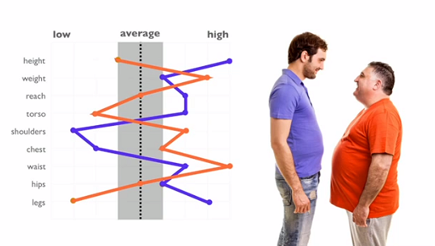

```{r setup, include=FALSE}
knitr::opts_chunk$set(echo = FALSE)
```

## What is the goal of this tutorial?

Technical hurdles of running Stan programs overcome
     Install, run, edit
Some idea of what Bayesian Modeling is about
   What are distributions, how do they work.
   What are the major selling points of Bayesian modeling
   How does it compare to other things
Understand the execution environment
   How to tear apart a Stan program and understand what it is doing
   Not teaching you statistics.

## Why Bayesian Modeling? 

 

Lt. Gilbert S. Daniels. Data from 4,063 pilots on 10 dimensions. 
Average was defined to be the 30% interval around the mean value, e.g.,5'7" to 5'11" height.
Point estimates from data hide a lot of information. How many pilots were found to be average across all dimensions? 
The core reason for the problem is that the measures are not correlated enough.

<!--<li> How many pilots were average across 3 dimensions? 3.5%-->
<!--50% <li> Expand average interval to 90%? of pilots fit then.-->


## Point estimates hide information, posteriors are richer information

 Least informative: Mean height 5'9" (69") across 4k pilots
 But lots of ways this could happen
## The uniform distribution
```{r}
hist(runif(1000,60,74))
mean(runif(1000,60,75))
```

## Normal Distribution, aka Bell Curve
```{r}
hist(rnorm(1000,69,4))
mean(rnorm(1000,69,4))
```

## Exponential Distribution
```{r}
hist(rexp(1000,1/69),breaks=100)
mean(rexp(1000,1/69))
```

## Playing with Distributions

<ul>
  <li>Distributions are functions from one or more configuration parameters to produce numbers. Graphing them with a histogram (bar chart) is a good way to see the shape of the produced numbers. </li>
  <li>Distributions are used to model phenomenon</li>
  <ul>
    <li>uniform ex</li>
    <li>height is additive, normal</li>
    <li>exponential is ?</li>
  </ul>
  </li>
  <li>Bayesian modeling focuses on systematiclly updating parameters based on data, e.g., what values of the chosen distribution fit the data the best?</li>
</ul>

## Some more distribution things

<ul>
  <li>A point estimate from any continuous distribution will have zero examples in general, e.g., 61 %in% runif(1000000,60,74) is nearly always false</li>
  <li>Need to specify a range to catch any chickens. Range version of same query.</li> 
  <li>Choice of distribution has a huge role in what we come to predict/understand the data.</li>
  <li>Distribution paramterizations tell us a lot about our confidence in how well we understand our data. It is the calculus of uncertainty and required to reason in the space.</li>

</ul>

## 42: Our Confidence in the "Answer to the Ultimate Question of Life, the Universe, and Everything"

<ul>
<li>Given a distribution, how do expose it to data and learn something?</li>
<li>Select a distibution: uniform. All values equally probably from the min and max values.</li>
<li>We want to learn the probability of the uniform distribution's possible min and max values with some data</li>
</ul>


## Metropolis-Hastings

See 
  stan/metropolis_zebra.stan
  stan/metropolis_one_param.stan
  stan/metropolis_two_param.stan


```{stan output.var=theAnswer.stan}

parameters {
 real<lower=0,upper=50> min_value;//starts life drawn from a uniform dist
  real<lower=50,upper=1000>  max_value;//starts life drawn from a uniform dist
}

model {
  42 ~ uniform(min_value,max_value);
  //
  //target +=  uniform_lpdf(42|(min_value,max_value))
}

```


```{r}
library(rstan)
library("shinystan")


fit <-
  sampling(theAnswer.stan)

print(fit)
```

As the number of data points increases, the min_value and max_value converge 42. 

```{stan output.var=theAnswerArbitrary.stan}
data {
  int number_iterations;
}

parameters {
  real<lower=0,upper=100> min_value;//starts life drawn from a uniform dist
  real<lower=0,upper=100>  max_value;//starts life drawn from a uniform dist
}

model {
  for (i in 1:number_iterations) {
    
    42+(i*.01) ~ uniform(min_value,max_value);
  }
}

```


```{r}
library(rstan)
library("shinystan")

number_iterations = 10; #try 0,1,10,100

fit <-
  sampling(theAnswerArbitrary.stan,data=c("number_iterations"));

print(fit)
```

# Lots of legos we can use for the same data

```{stan output.var=manyDistributions.stan}
data {
  int number_iterations;
}

parameters {
  real<lower=0,upper=100> min_value_uniform;//starts life drawn from a uniform dist
  real<lower=0,upper=100> max_value_uniform;//starts life drawn from a uniform dist
  real<lower=0,upper=100> alpha_mean_normal;
  real<lower=0,upper=2> sigma_standard_deviation_normal;
  real<lower=0,upper=10> lambda_exp_shape_param_exponential;
}


model {
  sigma_standard_deviation_normal ~ normal(0,1);
  for (i in 1:number_iterations) {
    42 ~ uniform(min_value_uniform,max_value_uniform);
    42+(i*.01)~ uniform(min_value_uniform,max_value_uniform);
    42 ~ normal(alpha_mean_normal,sigma_standard_deviation_normal);
    42+(i*.01)~ normal(alpha_mean_normal,sigma_standard_deviation_normal);
    42 ~ exponential(lambda_exp_shape_param_exponential);
    42+(i*.01)~ exponential(lambda_exp_shape_param_exponential);
  }
}

```

```{r}
library(rstan)
library("shinystan")

number_iterations = 2; #0,1,100


fit <-
  sampling(manyDistributions.stan,data=c("number_iterations"));

print(fit)
```

# Hello World in Stan

```{stan output.var=helloWorld.stan}

/*
 
Print Frequency
Printing for a print statement happens every time it is executed. The transformed
data block is executed once per chain, the transformed parameter and model blocks
once per leapfrog step, and the generated quantities block once per iteration

See p84 of https://mc-stan.org/docs/2_19/reference-manual-2_19.pdf for documentation of blocks. Lots of info there.
*/
functions {
  void helloWorld() {
    print("hello world! from a function in the functions block");
  }
}

data { 
real some_data;
  //Where one ingests data
  //No functions allowed
}

transformed data { 
  //Modify data or set it up here. 
  print("hello from transformed data");
  //real someDataBase10 = log(someData);
  
 
} 
parameters { 
  real<lower=0,upper=100> mu_TATLTUE;//The Answer to Life, the Universe, Everything
   //no functions
   //declare what parameters are being estimated
}
transformed parameters { 
  //mu_TATLTUE_log = log(mu_TATLTUE);//The Answer to Life, the Universe, Everything
  //??? set up relationships/constraints among paramaters of interest. 
  print("hellow from transformed paramters");
 
} 

model { 
  //setup priors and liklihood
  some_data ~ normal(mu_TATLTUE,0);
  print("Hello from the model block");
}

generated quantities { 
  //generate further data, good place to check that parameters are doing something useful
  print("Hello World from generated quantities");
} 


```

```{r}
library(rstan)
some_data = 42L; 
fit <-
  sampling(helloWorld.stan, data=c("some_data"),
           #algorithm = "Fixed_param", 
           chains=2,iter=100,warmup=50);

```

